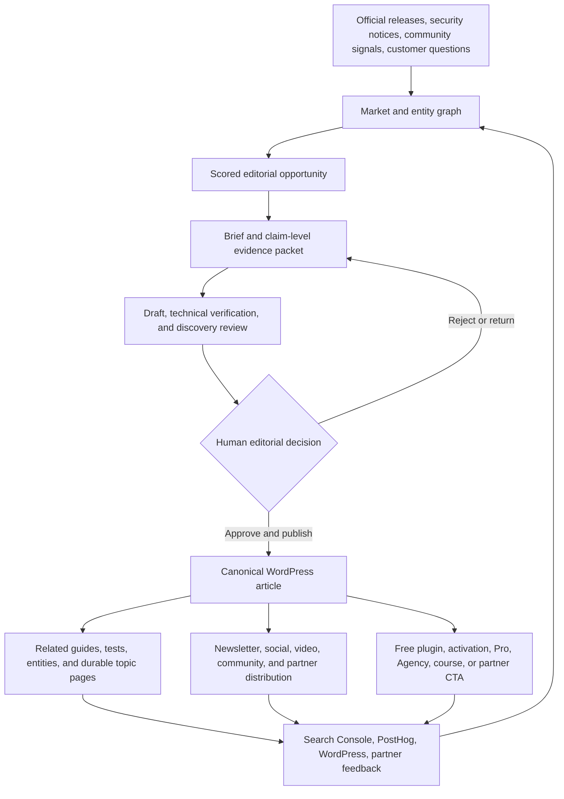

# MCPWP publication — read this first

> The single entrypoint for MCPWP's publication strategy, editorial system, and
> operating documentation. Truth lives once per topic; other documents link here
> instead of copying it.
>
> **Last updated:** 2026-07-29

## What MCPWP is

MCPWP is the commercial media publication at
[mcpwp.net](https://mcpwp.net): the intersection of WordPress, Model Context
Protocol, AI-assisted operations, and the mature plugin ecosystem.

It teaches the market, tests claims, reports important changes, and converts
qualified readers toward:

- the free MumCP WordPress plugin;
- MumCP Pro and Agency;
- paid courses by Hadi and ASTER;
- disclosed affiliate and partner offers; and
- future governed Agency workflows backed by Mupot after those workflows are
  verified end to end.

MCPWP is not the plugin brand. **MumCP** is the product; **Mumega** is the
company; **MCPWP** is the publication and category doorway.

## The living system

## Where each truth lives

| Topic | Canonical source |
|---|---|
| Mission, market loop, content wheel, partnerships, conversion, cadence, and measurement | [`docs/CONTENT-OPERATING-SYSTEM.md`](docs/CONTENT-OPERATING-SYSTEM.md) |
| Reusable theme behavior, adoption, build, and release procedure | [`README.md`](README.md) |
| Implemented editorial contract version and supported formats/roles | [`editorial/manifest.json`](editorial/manifest.json) |
| Editorial workflow states, actors, gates, and human-only transitions | [`editorial/workflow.json`](editorial/workflow.json) |
| Brief, research-packet, and validation-report data contracts | [`editorial/schemas/`](editorial/schemas/) |
| Evidence, discovery, freshness, disclosure, and WordPress handoff rules | [`editorial/rules/`](editorial/rules/) |
| Public article structures | [`editorial/templates/`](editorial/templates/) |
| Internal editorial agent boundaries | [`editorial/agents/`](editorial/agents/) |
| Generated, bounded context supplied to authorized WordPress agents | [`editorial/generated/mcpwp-site-context.md`](editorial/generated/mcpwp-site-context.md) |
| Homepage, ASTER, and visual/editorial architecture | [`docs/superpowers/specs/2026-07-19-mcpwp-homepage-v2-design.md`](docs/superpowers/specs/2026-07-19-mcpwp-homepage-v2-design.md) |
| Earlier reusable editorial-theme design | [`docs/superpowers/specs/2026-07-18-mcpwp-editorial-system-design.md`](docs/superpowers/specs/2026-07-18-mcpwp-editorial-system-design.md) |
| Implemented agentic editorial-contract design | [`docs/superpowers/specs/2026-07-19-agentic-editorial-system-design.md`](docs/superpowers/specs/2026-07-19-agentic-editorial-system-design.md) |
| Published articles, revisions, authors, media, categories, tags, menus, and public status | WordPress on mcpwp.net |
| Live audience and conversion measurements | Google Search Console and PostHog |
| Work state, assignments, approvals, receipts, and budgets | Mupot, not Markdown |
| MumCP product truth, release state, and plugin architecture | [`Mumega-com/mcpwp/TRUTH.md`](https://github.com/Mumega-com/mcpwp/blob/main/TRUTH.md) |

## Four homes, no mirrors

1. **Git** owns durable strategy, contracts, policies, theme behavior, and
   decision history.
2. **WordPress** owns public content and its revision history.
3. **PostHog and Search Console** own live behavioral and discovery evidence.
4. **Mupot** owns operational tasks, assignments, gates, receipts, and budgets.

A live count, ranking, conversion rate, task status, or partner state must not
be copied into this file as permanent truth. Link to or query its operational
source.

## Start here

An agent joining MCPWP work should:

1. read this file;
2. read the content operating system;
3. read only the relevant rule, format, role, or theme design;
4. verify live market, product, WordPress, and analytics state before making a
   current claim; and
5. preserve human-only publication and commercial authority.

If two documents disagree, update the stale document to link to the canonical
source. Do not create a third explanation.
