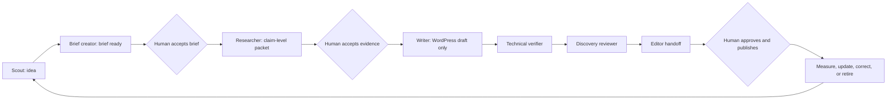

# MCPWP market-aware content operating system

> **Status:** approved strategy and canonical operating design
> **Approved:** 2026-07-29
> **Scope:** mcpwp.net publication, distribution, partnerships, and commercial
> conversion
> **Entry point:** [`/TRUTH.md`](../TRUTH.md)

## 1. Outcome

MCPWP becomes the trusted **WordPress × MCP market desk**: a commercial
publication that detects important changes, tests what matters, explains the
implications, and converts authority into MumCP customers, courses, affiliate
revenue, and partner relationships.

The publication advocates for the WordPress and MCP category while visibly
showcasing MumCP as its flagship product. It may cover other plugins and
providers when that coverage answers a real reader question or adds original
evidence. It does not manufacture pages merely to capture their keywords.

The commercial identity is:

| Surface | Role |
|---|---|
| **MCPWP / mcpwp.net** | publication, market authority, education, discovery, and partnership doorway |
| **MumCP** | Free → Pro → Agency product |
| **Mumega** | company and product owner |
| **ASTER** | disclosed synthetic research/editorial guide, not a human author or publication authority |
| **Hadi** | accountable human voice, commercial authority, reviewer, and course creator |
| **Mupot** | internal campaign control plane now; customer-facing governance only after verified proof |

The north-star outcome is **qualified activated sites**, not article count.

## 2. Chosen model

Three operating models were considered:

1. **High-volume scraped feed:** fastest volume, weakest trust, and unacceptable
   risk of scaled, unoriginal content.
2. **Evergreen academy only:** durable but too slow to reflect the market or
   create timely partner conversations.
3. **Market-aware evidence newsroom:** automated signal detection followed by
   claim-level research, original testing or analysis, human review, and
   measured distribution.

MCPWP uses the third model.

> Machines detect and organize opportunities. Evidence and accountable
> editorial judgment earn publication.

## 3. Non-negotiable boundaries

- No agent publishes, schedules, redirects, deletes, changes a canonical URL,
  approves a correction, or makes a commercial conclusion.
- Scrapers collect lawful signals, metadata, and canonical links. They do not
  reproduce another publisher's work or generate lightly rewritten pages.
- Official APIs, changelogs, RSS/Atom feeds, webhooks, repositories, and primary
  sources are preferred over page scraping.
- Automated access respects site terms, robots controls, rate limits, privacy,
  and applicable law. It never defeats access controls or challenges.
- Editorial coverage is not for sale. Sponsorship, affiliate interest,
  ownership, material support, and vendor access are disclosed.
- A covered company may correct facts and supply evidence. It cannot buy a
  verdict or veto an editorial conclusion.
- ASTER is disclosed as synthetic. Service accounts and internal agents do not
  become public human identities.
- Discover, Google News, rankings, AI citations, or backlinks are outcomes to
  measure, never promises.
- WordPress remains the content source of truth. The theme and editorial
  contract do not create a shadow CMS.

The implemented authority and workflow boundaries remain
[`editorial/workflow.json`](../editorial/workflow.json) and
[`editorial/rules/`](../editorial/rules/).

## 4. Point-in-time starting baseline

The following observations were read-only and were verified on 2026-07-29.
They are a starting snapshot, not permanent project truth:

- the public WordPress API returned 57 published posts;
- the newest published post was dated 2026-06-12;
- 16 of those posts had no featured image;
- a representative comparison article exposed the `mumcp` service account as
  its author; and
- that representative Article graph lacked a representative image,
  `dateModified`, and an Article-level publisher field.

Evidence:

- [public posts endpoint](https://mcpwp.net/wp-json/wp/v2/posts?per_page=100)
- [representative comparison article](https://mcpwp.net/wordpress-mcp-plugin-comparison-2/)
- [current publication feed](https://mcpwp.net/feed/)
- [current sitemap index](https://mcpwp.net/sitemap_index.xml)

The implication is not “publish more.” The immediate gap is a dependable
freshness rhythm, accountable authorship, meaningful lead media, original
evidence, and stronger relationships between articles.

## 5. Market sensing

### 5.1 Signal sources

The market graph draws from:

- WordPress core, Make WordPress AI, Abilities API, and MCP Adapter releases,
  issues, proposals, and security discussions;
- WordPress.org plugin releases, changelogs, support themes, reviews, and
  disclosed compatibility information;
- the MCP specification, SDKs, security guidance, and working-group releases;
- ChatGPT/OpenAI, Claude/Anthropic, Gemini/Google, Hermes, OpenClaw, Codex,
  Cursor, and other relevant client/provider release notes;
- security advisories, CVEs, incident timelines, patches, and verified
  mitigations;
- Search Console, PostHog, WordPress search, support questions, activation
  friction, sales questions, and course demand;
- Reddit, X, YouTube, Product Hunt, newsletters, podcasts, conferences, and
  communities as audience signals; and
- partner announcements, integrations, pricing changes, and verified factual
  corrections.

Community posts identify questions and language. They do not automatically
become facts.

### 5.2 Signal record

Each collected signal records:

```yaml
signal_id:
observed_at:
source_type:
source_url:
publisher:
entities:
event_type:
summary:
primary_source_available:
market_heat:
buyer_relevance:
product_relevance:
partner_potential:
evidence_advantage:
freshness_window:
rights_and_access_notes:
```

### 5.3 Opportunity scoring

A daily internal pulse scores candidates using:

| Factor | Weight |
|---|---:|
| Market heat and urgency | 25% |
| Reader and buyer relevance | 20% |
| Original evidence advantage | 20% |
| Search or recurring-question demand | 15% |
| Partner and distribution leverage | 10% |
| Commercial path | 10% |

Editorial, legal, security, duplication, evidence, and effort risks remain
gates, not factors that can be outweighed by a high score.

A high score creates a candidate brief. It never creates a public post.

## 6. Content wheel

| Lane | Reader value | Contract formats | Typical commercial path |
|---|---|---|---|
| **Market desk** | what changed and what it means | `news-briefing`, `analysis-opinion` | newsletter, free plugin, partner conversation |
| **MCPWP Lab** | reproducible tests, compatibility, benchmarks, and limitations | `test-report`, `comparison-review` | Pro, Agency, integration |
| **Field guides** | durable understanding and working procedures | `explainer`, `practical-guide` | free install, first successful connection, course |
| **Ecosystem desk** | honest plugin/provider coverage and combined workflows | any evidence-appropriate format | affiliate, co-marketing, integration, referral |
| **ASTER and Hadi** | recognizable analysis, briefing, teaching, and opinion | `analysis-opinion`, video/course derivative | subscription, course, community, product trust |

Every publication must either:

- add an original test or observation;
- synthesize primary sources into a useful decision;
- provide a reproducible implementation procedure; or
- make an evidence-led interpretation that is clearly labelled.

Those are already the `unique_value_type` options in
[`content-brief.schema.json`](../editorial/schemas/content-brief.schema.json).

## 7. Cadence

The starting cadence is:

- **daily:** automated internal market pulse and update-trigger scan;
- **weekly:** three canonical pieces:
  - one timely market analysis;
  - one original lab/test or workflow;
  - one ecosystem/plugin/provider piece;
- **weekly:** one ASTER/Hadi briefing adapted to video and social;
- **weekly:** one newsletter assembled from canonical nodes;
- **monthly:** one “State of WordPress × MCP” benchmark or market-map update;
  and
- **quarterly:** portfolio, partner, disclosure, author, structured-data, and
  conversion audit.

No publication quota overrides the evidence gate. A quiet market produces
fewer, better pieces.

## 8. Editorial and knowledge graph

The editorial state machine is implemented in
[`editorial/workflow.json`](../editorial/workflow.json):



### 8.1 The fractal mesh

Every public node connects upward, sideways, downward, and outward:

- **upward:** one durable topic hub or canonical page;
- **sideways:** at least two genuinely related articles, tests, entities, or
  workflows;
- **downward:** supporting evidence, method, version, limitation, correction,
  and update trigger;
- **outward:** primary sources and relevant partner/provider pages; and
- **commercially:** one context-appropriate next action.

WordPress supplies the public graph:

- categories = durable topic and audience rails;
- tags = public entities, plugins, providers, protocols, and concepts;
- contextual internal links = directed knowledge edges;
- canonical URLs = stable node identifiers;
- revisions and correction notes = history; and
- featured media = meaningful visual evidence, not decoration.

The graph should let a reader or model move from a current event to the durable
concept, the original evidence, a working procedure, related ecosystem
entities, and the appropriate product action.

### 8.2 Current contract versus operating metadata

The current brief contract already requires intent, audience, format, unique
value, entities, evidence, internal links, reviewer, freshness, update trigger,
AI disclosure, and commercial relationship.

The following strategy overlay is not yet valid inside the strict `1.0.0`
brief schema:

```yaml
business_goal:
funnel_stage:
primary_cta:
partner_target:
distribution_plan:
metric_plan:
campaign_id:
```

Until the editorial contract advances, store that overlay in the Mupot task or
campaign record and reference the canonical slug. Do not add undeclared fields
to a `1.0.0` content brief.

## 9. Distribution wheel

One canonical WordPress article may produce:

- an email/newsletter entry;
- an X thread;
- a LinkedIn post;
- a relevant Reddit discussion or answer where community rules permit it;
- a short ASTER/Hadi video;
- a YouTube briefing or longer tutorial;
- a Medium syndication with the MCPWP URL as canonical when supported;
- a partner briefing;
- a Product Hunt or launch-community update when genuinely relevant; and
- a GitHub issue or pull request only when the article reveals a real,
  contribution-worthy technical improvement.

Derivatives summarize or adapt the canonical work to the channel. They do not
become a swarm of near-duplicate pages, unsolicited promotions, or copied
community posts.

RSS/Atom remains useful for readers, partners, newsletters, and agents even
though Google News no longer uses feeds submitted through Publisher Center.

## 10. Google Discover and Google News readiness

### 10.1 What can and cannot be controlled

Indexed, policy-compliant pages are automatically eligible for Discover; no
special tag or application guarantees inclusion. Google describes Discover
traffic as less predictable than keyword-driven search, so it is a supplemental
surface, not the business foundation.

Eligible publisher content is also considered automatically for Google News.
Since March 2025, Google News publication pages are generated automatically and
submitted Publisher Center RSS/web locations are no longer the inclusion path.

### 10.2 Publication requirements

MCPWP should maintain:

- accurate, non-clickbait headlines that match the page;
- visible original publication time and meaningful modification time;
- named authors, reviewer accountability where material, author profiles,
  publication ownership, company information, and contact information;
- `Article` or `NewsArticle` structured data matching visible content;
- crawlable canonicals and stable text links;
- relevant lead images at least 1200 pixels wide, more than 300,000 total
  pixels, and suitable for a 16:9 crop;
- `max-image-preview:large`;
- `og:image` or schema image references to the representative article image;
- a rolling news sitemap containing only articles published in the previous two
  days, with no more than 1,000 news entries per sitemap;
- visible methods, sources, limitations, corrections, commercial disclosures,
  and AI-assistance disclosures; and
- good mobile page experience.

### 10.3 Image policy

MCPWP uses fewer, stronger images:

- ASTER appears on ASTER briefings, opinion, and editorial-guide surfaces—not
  as a generic thumbnail on every post.
- Test reports use real screenshots, diagrams, or data visuals from the test.
- Practical guides use a meaningful workflow visual only when it helps.
- Partner coverage uses product media or logos only with appropriate rights and
  context.
- Generic robots, unrelated stock art, decorative AI imagery, logo-only lead
  images, and text-heavy thumbnails are avoided.
- Every lead image has a useful crop, dimensions, provenance, alt decision, and
  rights record.

The default editorial lead asset is 1280×720 unless the source evidence
requires another composition.

### 10.4 Primary policy references

Reviewed 2026-07-29:

- [Google: Discover and your website](https://developers.google.com/search/docs/appearance/google-discover)
- [Google: guidance on generative AI content](https://developers.google.com/search/docs/fundamentals/using-gen-ai-content)
- [Google: spam policies](https://developers.google.com/search/docs/essentials/spam-policies)
- [Google News policies](https://support.google.com/news/publisher-center/answer/6204050)
- [Google News article-page best practices](https://support.google.com/news/publisher-center/answer/9607104)
- [Google: Article structured data](https://developers.google.com/search/docs/appearance/structured-data/article)
- [Google: news sitemaps](https://developers.google.com/search/docs/crawling-indexing/sitemaps/news-sitemap)
- [Google News automatic publication pages](https://support.google.com/news/publisher-center/answer/15898024)

Recheck these primary sources before changing policy-dependent implementation.

## 11. MCPWP Ecosystem Desk

The ecosystem desk turns useful coverage into partner opportunity without
selling editorial conclusions.

### 11.1 Editorial ladder

1. A market-relevant mention based on primary evidence.
2. A tested integration, compatibility report, or combined workflow.
3. A comparison using a published method and reproducible criteria.
4. A factual-correction window before or after publication.
5. A durable entity/plugin page connected to related guides and tests.

Editorial inclusion does not require payment.

### 11.2 Commercial ladder

After editorial fit is established:

1. co-distribution or a reciprocal technical tutorial;
2. integration or compatibility work;
3. a disclosed affiliate agreement;
4. a webinar, course module, or launch briefing;
5. a disclosed sponsored lab or campaign;
6. agency/customer referrals where the operational fit is proven.

Commercial terms are handled separately from the research verdict. A partner
may verify facts and provide access; it may not approve the conclusion.

## 12. Conversion architecture

Every canonical node has one primary next action matched to reader state:

| Reader state | Primary action |
|---|---|
| Learning the category | follow a topic, subscribe, or read the durable guide |
| Comparing approaches | inspect the method, test, or transparent comparison |
| Ready to try | download MumCP Free |
| Installed but not connected | complete the first-connection guide |
| Experiencing product value | evaluate MumCP Pro |
| Operating multiple sites | evaluate Agency |
| Wants structured learning | join a course or waitlist |
| Represents a plugin/provider | propose evidence, testing, or partnership |

Not every article receives a hard sales pitch. The CTA must be the natural next
step supported by the article.

## 13. Measurement and feedback

### 13.1 North star

**Qualified activated sites:** readers who reach a measurable first successful
MCP connection on a site that fits the intended audience.

### 13.2 Supporting measures

| Layer | Measures | Source of truth |
|---|---|---|
| Discovery | indexed URLs, impressions, clicks, CTR, Discover and News data when thresholds expose them | Search Console |
| Reading | qualified article view, engaged time, meaningful scroll, internal knowledge-edge use | PostHog |
| Intent | free download, setup-guide visit, pricing visit, course interest, partner inquiry | PostHog and destination system |
| Activation | first successful connection and first successful governed operation | product telemetry, when safely instrumented |
| Revenue | Free→Pro, Pro→Agency, course sale, affiliate revenue | Freemius/checkout and approved reporting |
| Ecosystem | partner conversations, tested integrations, backlinks, co-distribution | Mupot campaign/project records |
| Quality | correction rate, stale content, failed evidence gates, unsupported claims prevented | editorial workflow and WordPress revisions |

The implementation must verify existing event names before adding or reporting
them. Strategy labels are not proof that an event is instrumented.

### 13.3 Update triggers

A published node is reconsidered when:

- a named plugin, protocol, model, API, price, security posture, or compatibility
  changes;
- a primary source is corrected or superseded;
- a partner supplies verifiable factual evidence;
- a material claim loses support;
- Search Console performance materially changes;
- PostHog exposes conversion or comprehension friction;
- MumCP releases a capability that changes the reader decision; or
- the scheduled freshness class review becomes due.

Published dates are not refreshed merely to appear current.

## 14. Mupot operating model

Mupot owns the campaign and work state:

- market-scan tasks;
- briefs and research assignments;
- human gates;
- content/update ownership;
- partner target and outreach state;
- channel derivatives;
- spend caps;
- evidence receipts; and
- performance-review tasks.

Git stores this durable strategy and editorial contract. WordPress stores the
public artifact. Mupot stores who is doing what next.

Agents may collect, score, propose, research, draft, verify, and prepare
distribution. Human authority is required for publication, corrections,
commercial conclusions, outbound partner commitments, paid spend, and sensitive
security claims.

## 15. First 30-day content wheel

The first pillar is a living **MCP for WordPress market map**. Candidate spokes,
subject to evidence and duplication checks:

### Week 1 — establish the category

- State of WordPress × MCP: current architecture, choices, and open gaps.
- What the current MCP specification changes mean for WordPress operators.
- Tested path: WordPress to first successful connection with a supported AI
  client.

### Week 2 — prove the ecosystem thesis

- WordPress core/Abilities/MCP Adapter versus a full site-operations plugin:
  different jobs, not a manufactured fight.
- One reproducible workflow with an established WordPress plugin.
- One provider/plugin spotlight based on a real test and limitations.

### Week 3 — earn operational trust

- Security model: scopes, approvals, audit, rollback, and remaining risks.
- Agency workflow: one governed change across multiple sites.
- Incident-response or update timeline when a real market event exists.

### Week 4 — convert learning into action

- Transparent WordPress MCP comparison with a published method.
- ASTER/Hadi monthly market briefing.
- Free-to-first-connection course lesson and activation guide.

Each week produces one newsletter and one bounded distribution package. Partner
outreach begins only after the relevant canonical evidence exists.

## 16. Definition of done

This strategy is operational when:

- [`/TRUTH.md`](../TRUTH.md) is the entrypoint used by agents and humans;
- each active article has a parent topic, evidence, author, update trigger,
  related nodes, disclosure, and one primary next action;
- the market pulse creates candidates without auto-publishing;
- the editorial workflow remains contract-valid and human-gated;
- author/service-account, image, Article metadata, and news-sitemap launch gaps
  are resolved and verified on rendered public pages;
- Search Console and PostHog measurements feed periodic editorial decisions;
- partner coverage and commercial terms remain visibly separate; and
- the first 30-day wheel produces activation and partner evidence rather than
  only pageviews.
