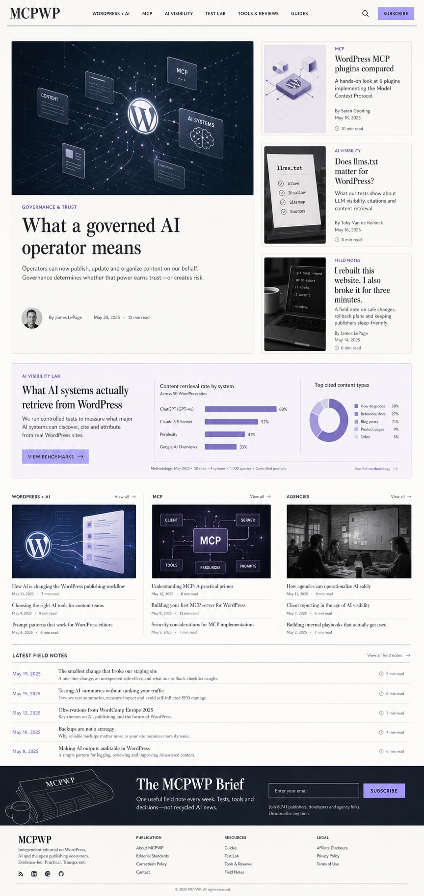

# MCPWP editorial system for Mumega Motion

**Date:** 2026-07-18  
**Status:** Approved visual direction; implementation plan pending user review  
**Repository:** `Mumega-com/mumega-motion-theme`  
**Site:** `https://mcpwp.net`  
**Implementation branch:** `feat/mcpwp-editorial-system`

## Objective

Turn Mumega Motion into a reusable, server-rendered editorial system that launches MCPWP as a credible publication about the intersection of WordPress, AI, and the Model Context Protocol.

MCPWP must read as an independent media and research property, not as a landing page for the MCPWP or Mumega MCP plugin. The publication should help WordPress owners, agencies, developers, and content teams understand and adopt AI without abandoning their existing sites.

The primary launch conversion is subscription to **The MCPWP Brief**. Authority and audience growth come before product promotion.

## Approved visual direction

The approved direction combines:

- **The Editorial Desk:** a balanced publication homepage with a lead investigation, supporting stories, topic rails, research results, field notes, and newsletter conversion.
- **The Research Journal:** restrained typography, explicit methodology, visible authorship, and fewer unsupported claims.



The image is a visual reference, not a pixel-perfect contract. The implementation must preserve its hierarchy, editorial character, and restrained palette while using real WordPress content and accessible responsive behavior.

## Existing state and constraints

The live audit on 2026-07-18 found:

- Mumega Motion is the active theme.
- The live static homepage is an Elementor page titled `MCPWP - WordPress MCP Server for AI Site Operations`.
- The site contains 64 posts: 57 published and 7 drafts.
- The site contains 49 pages: 42 published and 7 private.
- Existing categories are Compare, Field Notes, For Agencies, Governance & Trust, Integrations, MCP Guides, Releases, Tutorials, and Use Cases. The empty General category is not useful editorially.
- MCPWP 3.6.1, Elementor, Elementor Pro, Yoast SEO, WPForms, Site Kit, MonsterInsights, PostHog, WooCommerce, LearnPress, and several hosting/support plugins are active.
- The Yoast plugin screen emits PHP warnings about a missing `wpseo_premium` option. That defect requires a separate operational fix before public launch; it is not theme behavior.
- Multiple analytics plugins are active. Analytics consolidation is an operational follow-up, not part of the theme implementation.
- Mumega Motion already provides progressive-enhancement Motion components, Figma token consumption, and a verified GitHub edge-release/update channel.

The implementation must preserve existing Elementor pages and must not deactivate, uninstall, rewrite, or delete plugins or content.

## Chosen architecture

### Hybrid classic theme with Gutenberg content

Mumega Motion remains a classic PHP theme with `theme.json` design tokens and Gutenberg as the article-authoring surface.

PHP owns deterministic, semantic, server-rendered templates. Gutenberg owns article bodies and reusable editorial patterns. Motion remains progressive enhancement over HTML that is complete before JavaScript runs.

This architecture was selected over:

- **A full block-theme conversion:** flexible but unnecessarily broad for the first editorial release and more vulnerable to accidental template edits.
- **An Elementor rebuild:** faster for one page but inconsistent with the theme's reason for existing, harder to govern through agents, and less deterministic.

### Safe homepage rollout

The first editorial release must **not** add `front-page.php`. Because Mumega Motion is already active, adding that file would replace the live homepage immediately when the theme update is installed.

Instead, the theme adds a named page template at `page-templates/editorial-home.php`.

Rollout sequence:

1. Install the theme update without changing the current homepage.
2. Create a new WordPress page named `MCPWP Editorial Home`.
3. Assign the Editorial Home page template.
4. Preview the page while it is draft or private.
5. Validate desktop, mobile, accessibility, performance, links, queries, and empty states.
6. Publish the page.
7. Change **Settings → Reading → Homepage** to the new page.

Rollback requires only restoring the previous Elementor page as the static homepage. The existing page remains published and untouched.

## Theme boundaries

### Mumega Motion owns

- Page composition and visual hierarchy.
- Header, footer, homepage, article, archive, search, page, and error templates.
- Responsive layout, typography, colors, focus states, and print styles.
- Editorial query selection and duplicate exclusion.
- Reusable Gutenberg patterns for consistent article structure.
- Progressive-enhancement motion and reduced-motion behavior.
- Graceful empty states and plugin-independent fallbacks.

### WordPress core owns

- Posts, pages, authors, excerpts, featured images, categories, tags, sticky state, menus, and media.
- Content editing through Gutenberg.
- Homepage selection through Reading Settings.

### Other plugins and services own

- **MCPWP:** authenticated agent operations and explicit theme update/rollback tools.
- **Yoast:** canonical URLs, sitemaps, and schema after its existing warning is fixed. The theme must not emit competing Article schema.
- **WPForms or an email provider:** subscriber validation, storage, consent, confirmation, and delivery.
- **Analytics platform:** tracking and consent. The theme provides stable semantic hooks but no analytics vendor code.
- **Elementor:** legacy product and documentation pages during migration.

No new plugin is required for the first editorial theme release.

## Editorial information architecture

### Primary public sections

The primary navigation is:

1. **WordPress + AI**
2. **MCP**
3. **AI Visibility**
4. **Test Lab**
5. **Tools & Reviews**
6. **Guides**

The theme queries section categories by stable slugs, never database IDs:

| Section | Slug |
|---|---|
| WordPress + AI | `wordpress-ai` |
| MCP | `mcp` |
| AI Visibility | `ai-visibility` |
| Test Lab | `test-lab` |
| Tools & Reviews | `tools-reviews` |
| Guides | `guides` |

### Existing-category migration

The existing corpus is migrated without changing URLs:

| Existing category | Editorial treatment |
|---|---|
| MCP Guides | Add MCP; add Guides when the article is instructional |
| Tutorials | Add Guides and the relevant topic section |
| Integrations | Add WordPress + AI or MCP according to the article |
| Compare | Add Tools & Reviews |
| Use Cases | Add WordPress + AI |
| Governance & Trust | Retain as a secondary category; also assign a primary topic |
| For Agencies | Convert to an audience tag or retain as a secondary landing category |
| Field Notes | Retain as a recurring editorial series, not a top navigation section |
| Releases | Keep as a secondary product-update archive, excluded from the main homepage unless manually featured |
| General | Stop assigning; remove only after confirming no content depends on it |

Posts may belong to one topic section and one format/series. Migration must not mass-change slugs or permalinks.

### Corpus cleanup

Content work is a separate editorial operation but is required before the public switch:

- Select and revise cornerstone articles about WordPress MCP, security, governance, MCP versus REST, plugin comparisons, and AI visibility.
- Merge overlapping plugin-comparison and connection-tutorial articles only after choosing canonical URLs and preparing permanent redirects.
- Remove outdated years from titles or update the underlying research; for example, a 2026 site must not promote an unreviewed `Best WordPress MCP Plugin 2025` article as current.
- Move product announcements out of the primary editorial stream.
- Add methodology and affiliate disclosure to reviews and comparisons.
- Preserve transparent Field Notes that demonstrate real testing, failures, and corrections.

## Homepage composition and data flow

The Editorial Home template is fully server-rendered and data-driven. Editors do not rebuild its layout.

### 1. Publication header

- Text masthead rendered from the WordPress site title, which must be `MCPWP` at launch.
- Primary navigation menu.
- Native WordPress search form; it remains usable without JavaScript.
- Persistent Subscribe link to the published `/newsletter/` page.
- Mobile navigation that works with keyboard and screen readers.
- If no primary menu is assigned, fall back to links for the six primary section categories that exist; never emit an empty navigation landmark.

### 2. Lead desk

- The newest published sticky post is the lead story.
- If no sticky post exists, the newest published non-Release post is the fallback.
- The lead displays featured image when available, primary category, title, excerpt, author, published/updated date, and estimated reading time.
- Three supporting stories use the newest eligible posts excluding the lead and excluding each other.
- Product Releases are excluded unless a Release post is deliberately sticky.
- A sticky Release is therefore an explicit editorial override and remains eligible.

### 3. AI Visibility Lab

- Uses the newest post in `test-lab` as the featured experiment.
- Displays the experiment's featured image, title, excerpt, date, and a link to its visible methodology.
- The first release does not invent or store benchmark data in theme options.
- Charts and numeric results must be authored as visible post content or media; the theme does not infer values from prose.
- If Test Lab has no published content, the entire module is omitted without leaving an empty heading.

### 4. Topic rails

- Three initial rails: WordPress + AI, MCP, and the first section in the fixed order AI Visibility, Tools & Reviews, Guides that has at least three eligible posts.
- Each rail shows one visual lead and two compact links.
- A post already used above is excluded from every later module.
- A missing or undersupplied category causes the layout to redistribute available rails rather than show placeholders.

### 5. Latest Field Notes

- Shows the five newest posts in the existing `field-notes` category.
- Emphasizes dates, titles, short descriptions, and reading time.
- Omits the section if no eligible posts exist.

### 6. The MCPWP Brief

- Dark, visually distinct newsletter module near the bottom of the page.
- Copy: “One useful field note every week. Tests, tools and decisions—not recycled AI news.”
- The theme does not store subscribers.
- The template looks for a published Gutenberg page with slug `newsletter-signup-embed` and renders its block content inside the form area. That page may contain a WPForms block or a provider's embed block.
- Rendering the embed page must preserve and restore the homepage's global post state.
- If the embed page does not exist or has no content, the module displays a Subscribe button only when a published page with slug `newsletter` exists. Otherwise it displays “Newsletter signup is being prepared” with no dead form or link.
- Public launch requires either a working embed page or a published Newsletter page; the non-interactive fallback is for preview and failure handling only.

### 7. Publication footer

- Short publication description.
- Editorial Standards, Corrections Policy, Affiliate Disclosure, Privacy Policy, Terms, About, and Contact links.
- Secondary resource links and social links supplied through WordPress menus.
- No plugin sales CTA in the global footer.
- Policy/resource links are menu-managed and render only when assigned, preventing dead placeholder links.

### Query invariants

- No post appears twice on the homepage.
- Only published posts are eligible.
- Password-protected posts are excluded.
- Sticky lead selection is deterministic.
- All post IDs already rendered are passed to later queries through one explicit exclusion list.
- Category lookup failures return an empty result and never a fatal error.
- All query state is reset after each module.
- The primary category shown on cards and articles is the first assigned category found in this fixed priority: WordPress + AI, MCP, AI Visibility, Test Lab, Tools & Reviews, Guides. If none match, use the alphabetically first assigned category other than General.

## Article experience

The `single.php` template provides:

- Primary section label.
- One H1 title.
- Excerpt as an answer-first summary when present.
- Visible author, published date, modified date when at least 24 hours later than publication, and reading time.
- Featured image with WordPress responsive image attributes.
- A readable article column with optional wide media.
- Author biography.
- Related stories chosen from the primary category and excluding the current post.
- A global affiliate-disclosure link and visible disclosure block when the post has the `affiliate` tag.
- Previous/next navigation where appropriate.

The first release does not auto-generate a table of contents. Authors and agents may insert a supplied Article Brief Gutenberg pattern containing:

- Summary.
- Key takeaways.
- Table of contents block or linked heading list.
- Methodology.
- Sources.
- Corrections/update note.

This avoids brittle server-side rewriting of arbitrary heading markup.

Reading time is the ceiling of visible article words divided by 225 words per minute, with a minimum of one minute. Card summaries use the manual excerpt when present; otherwise they use the first 28 visible words after stripping blocks, shortcodes, and HTML.

## Reusable Gutenberg patterns

The theme registers patterns, not custom content storage:

1. **Article Brief:** summary, key takeaways, and contents.
2. **Test Method:** question, environment, models/tools tested, procedure, date, limitations, and results.
3. **Evidence Table:** claim, observation, source, and confidence.
4. **Affiliate Disclosure:** standardized disclosure text and policy link.
5. **Correction Note:** dated correction with the previous claim and revised finding.
6. **Newsletter Embed Page:** instructions and a provider-neutral block insertion area.

Patterns use core blocks so content remains portable if the theme changes.

## Template and component structure

The implementation should create focused template units rather than one large `index.php`:

```text
header.php
footer.php
page.php
single.php
archive.php
search.php
404.php
home.php
page-templates/
  editorial-home.php
template-parts/
  content-card.php
  content-card-compact.php
  lead-story.php
  section-heading.php
  newsletter.php
  article-meta.php
  empty-state.php
inc/
  editorial-setup.php
  editorial-queries.php
  editorial-patterns.php
  editorial-helpers.php
assets/
  css/
    editorial.css
    print.css
theme.json
```

This file map is the implementation contract. Additional test fixtures and development-only files may be added without changing these production responsibilities.

## Visual system

### Character

- Serious independent technology publication.
- Warm paper background, near-black ink, muted gray, and restrained lavender accent.
- Editorial serif for major headlines; clean sans serif for interface text and body copy.
- Thin rules and spacing establish hierarchy; cards are used sparingly.
- Photography, diagrams, screenshots, and test artifacts should look reported, not generated for decoration.

### Responsive behavior

- Desktop lead desk uses an asymmetric main-and-supporting grid.
- Tablet reduces the supporting column without hiding metadata.
- Mobile becomes a single reading order: lead, supporting stories, Lab, topic rails, Field Notes, newsletter.
- Navigation collapses to an accessible disclosure/menu control.
- No horizontal scrolling at 320 CSS pixels.

### Motion

- Motion may animate section entrance, card sequencing, and navigation transitions.
- Content and controls exist and work before JavaScript.
- `prefers-reduced-motion: reduce` removes nonessential animation.
- StreamingText is not used on the editorial homepage.
- Motion must not move layout after interaction or delay access to article links.

## Accessibility, performance, and machine readability

### Accessibility

- Semantic `header`, `nav`, `main`, `article`, `section`, `aside`, and `footer` landmarks.
- One H1 per page and ordered heading levels.
- Visible skip link and focus indicators.
- Keyboard-operable menus, search, forms, and links.
- WCAG 2.2 AA color contrast.
- Meaningful alt text comes from the WordPress media field; decorative images use empty alt text.
- Form errors and labels are owned by the newsletter provider but must fit the theme visibly.

### Performance

- All critical editorial content is present in the initial HTML response.
- Below-the-fold images use native lazy loading; the lead image is not lazy-loaded.
- Responsive image sizes prevent oversized downloads.
- Editorial CSS is loaded only on relevant front-end templates.
- No new frontend framework or bundled React copy is added.
- The existing Motion bundle remains the only JavaScript enhancement dependency.
- Launch targets: no console errors, no PHP warnings from theme code, and Core Web Vitals in the “good” range under representative production testing.

### Search and AI visibility

- Server-rendered article text and navigation.
- Clear answer-first summaries and visible primary sources.
- Stable author identity, publication dates, modification dates, and correction notes.
- Semantic headings and link text.
- Yoast remains the only schema/canonical owner to prevent duplicates.
- Structured data must describe visible content.
- `llms.txt` is not part of the theme release. It may be tested later by the AI Visibility Lab as an experimental convention, not presented as a ranking standard.

## Error handling and fallbacks

- Missing featured image: render a typography-led card without a broken placeholder image.
- Missing excerpt: generate a bounded plain-text summary from post content for cards only.
- Missing sticky post: use the newest eligible post.
- Missing editorial category: omit that module and redistribute the grid.
- Missing newsletter embed page: link to the published Newsletter page when present; otherwise render the non-interactive preview fallback.
- Missing Yoast, Elementor, WPForms, MCPWP, analytics, or Figma tokens: the theme continues rendering without fatal errors.
- Failed image load: preserve article title and metadata layout.
- Empty search/archive: show a useful empty state and navigation back to current sections.
- Update discovery failure: continue using the installed theme exactly as the existing update design requires.

## Testing and verification

### Automated

- PHPUnit tests for lead selection, fallback selection, category lookup, exclusion-list behavior, Release exclusion, and graceful missing-content states.
- PHPUnit tests for reading-time and summary helpers.
- PHP syntax checks on PHP 7.4 and the current supported PHP version.
- WordPress Coding Standards on new PHP files.
- Existing update-channel tests remain green.
- Production JavaScript build remains green.
- Packaging test confirms all new runtime templates, CSS, `theme.json`, and patterns are included while development artifacts remain excluded.

### Rendered verification

- Preview the draft Editorial Home without changing the live homepage.
- Verify desktop, tablet, and mobile layouts, including 320-pixel width.
- Verify homepage has one H1, no duplicated post cards, valid links, and no empty module headings.
- Verify keyboard navigation, focus order, skip link, and reduced motion.
- Verify article, category, search, page, 404, and posts-index templates.
- Verify existing Elementor product pages still render unchanged.
- Verify Yoast emits one canonical and one schema graph after its separate warning is fixed.
- Verify no theme PHP warnings, browser console errors, mixed content, or failed assets.
- Run a representative performance audit on the preview and after launch.

### Launch verification

After changing the static homepage setting:

1. Confirm the new homepage URL returns HTTP 200 to a logged-out request.
2. Confirm the expected page title, canonical, H1, lead story, and Subscribe destination.
3. Confirm desktop and mobile screenshots match the approved hierarchy.
4. Confirm the old Elementor homepage remains published and selectable for rollback.
5. Confirm MCP-triggered update and rollback operations remain available and scoped to admin.

## Explicit non-goals for the first release

- Removing Elementor or converting every existing page.
- Installing or configuring an email service.
- Storing subscribers in the theme.
- Consolidating analytics plugins.
- Fixing Yoast's existing option warning.
- Building a paywall, membership system, recommendation engine, or personalized feed.
- Automatically publishing agent-generated content.
- Creating custom post types for experiments or reviews.
- Building an AI chatbot or “Ask MCPWP” interface.
- Publishing `llms.txt` as a claimed visibility solution.
- Rewriting or redirecting existing content without a separately approved migration map.
- Adding a new comments interface or comment-notification workflow.

## Definition of done

The editorial-system implementation is complete only when:

- The new Editorial Home can be previewed independently while the existing homepage remains live.
- Homepage, article, archive, search, page, error, and posts-index templates render correctly.
- The approved editorial hierarchy is present on desktop and mobile.
- Homepage modules are driven by real posts/categories and never duplicate stories.
- Gutenberg patterns support consistent human and agent-assisted publishing.
- Newsletter integration is provider-neutral and has a working fallback.
- Public launch has either a working newsletter embed or a published Newsletter destination; the non-interactive preview fallback is not sufficient for launch.
- Existing Elementor pages remain intact.
- Accessibility, PHP, coding-standard, build, packaging, unit, responsive, and rendered checks pass.
- The homepage switch and one-setting rollback are documented and verified.
- No required behavior in the new editorial templates depends on JavaScript, MCPWP, Yoast, Elementor, WPForms, analytics, or Figma being available. Untouched legacy pages may continue to depend on Elementor during migration.
