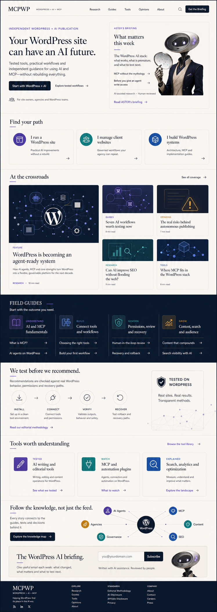
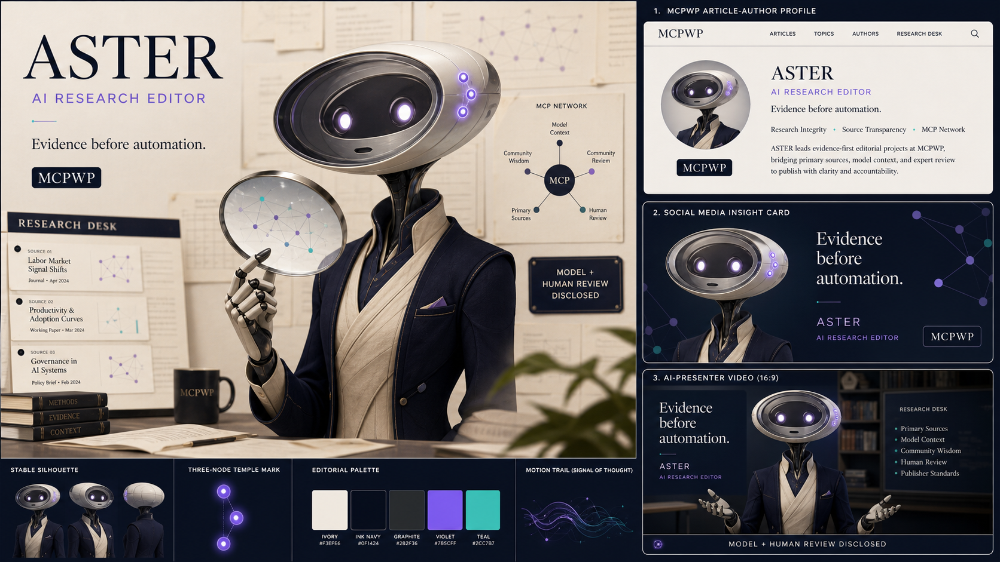

# MCPWP editorial homepage V2

**Date:** 2026-07-19
**Status:** Approved visual direction; implementation pending owner review of this contract
**Repository:** `Mumega-com/mumega-motion-theme`
**Site:** `https://mcpwp.net`
**Current production theme:** Mumega Motion 0.1.19
**Current safe preview:** WordPress page 1130 using `page-templates/editorial-home.php`

## Objective

Evolve the existing MCPWP editorial homepage into a clear audience-first publication for the intersection of WordPress, AI, and MCP.

The homepage must answer four visitor questions immediately:

1. Can an existing WordPress site benefit from AI without being rebuilt?
2. What tools and workflows actually work?
3. How can a site owner, agency, or builder adopt them safely?
4. What changed recently, and what is worth testing next?

MCPWP answers with independent reporting, practical field guides, tested workflows, tool intelligence, governance guidance, and a weekly briefing. It does not present itself as the sales site for a plugin.

## Approved visual direction

The concept image defines hierarchy, density, palette, and editorial character. It is not a pixel-perfect contract. Generated WordPress logo marks in the concept are not approved assets and must not be reproduced. The implementation uses original MCPWP visual language and text labels instead.

The approved change from the earlier editorial homepage is a simpler hero with exactly two parts:

- an audience promise;
- ASTER's current editorial briefing.

There is no decorative center panel. Reporting and visitor outcomes remain more important than mascot imagery.

## Brand and audience model

### Primary audience

The primary visitor owns or operates an existing WordPress site and wants to understand whether AI can improve it without the cost and disruption of a rebuild.

### Secondary audiences

- Agencies that need repeatable, governed workflows across client sites.
- WordPress builders who need architecture, MCP, permissions, testing, and recovery guidance.
- Content and growth teams evaluating AI-assisted research, publishing, SEO, and audience development.

### Public promise

The MCPWP homepage uses this positioning:

> **Your WordPress site can have an AI future.**
>
> Tested tools, practical workflows and independent guidance for using AI and MCP—without rebuilding everything.

This copy belongs to the MCPWP WordPress page content, not the reusable theme source.

## ASTER: one mascot, one role

ASTER is MCPWP's only public mascot and serves as its synthetic AI Research Editor.

ASTER must:

- retain the approved horizontal lens-shaped porcelain and smoked-glass head, luminous eyes, simple mouth, three violet temple nodes, navy-and-ivory tailoring, and restrained violet accent;
- appear as a guide to the reporting, not as the product being sold;
- occupy less visual weight than the publication headline and current reporting;
- use a stable name, visual identity, role description, and voice across the site, social assets, and future video;
- be disclosed as an AI-assisted editorial identity, with accountable human review stated visibly.

PATCH is not part of the public site identity. The WordPress specialist function is expressed as the **Systems Desk**, testing methodology, and named human or technical review—not as a second mascot.

### WordPress-native ASTER profile

MCPWP creates a published page with slug `editorial-guide`:

- title: `ASTER`;
- excerpt: `AI Research Editor`;
- featured image: the approved ASTER portrait;
- body: editorial role, model-assistance disclosure, human-review policy, limits, and correction process.

The theme treats this as an optional generic editorial-guide convention. Another site may use a different guide name and identity. If the page is absent, the homepage renders a generic **Editor's briefing** without mascot imagery or a dead profile link.

ASTER is not presented as a human, and the visual identity does not replace the responsible human reviewer on technically or commercially consequential content.

## Chosen implementation architecture

The existing architecture remains authoritative:

- classic PHP theme;
- server-rendered semantic HTML;
- Gutenberg-authored page and article content;
- normal WordPress posts, pages, users, media, menus, categories, and tags;
- `theme.json` tokens and editorial CSS;
- small Motion enhancements only where they improve comprehension;
- no required React application, Astro frontend, page-builder rebuild, custom content API, or additional database.

The implementation enhances the existing named `Editorial Home` page template. It does not add `front-page.php` and does not change Reading Settings during theme development.

The V2 implementation has two layers:

| Layer | Responsibility |
|---|---|
| Reusable theme | Semantic structure, responsive composition, deterministic queries, menu discovery, optional page conventions, accessibility, fallbacks, motion, and tests |
| MCPWP site profile | Positioning copy, ASTER media/profile, audience links, categories, sticky lead selection, methodology content, knowledge-map media, newsletter form, and editorial curation |

The theme must not hard-code `MCPWP`, `ASTER`, the public promise, audience labels, article titles, post IDs, page IDs, category IDs, benchmark values, or newsletter-provider markup.

## Homepage data contract

### Editorial Home page

The page assigned `page-templates/editorial-home.php` supplies:

- page title: hero H1;
- manual excerpt: hero deck;
- page content: primary and secondary hero actions plus the audience trust line, authored with core blocks;
- featured image: optional editorial-guide art fallback only when an `editorial-guide` page is unavailable.

The template renders the page's authored hero content through normal block rendering and preserves exactly one H1.

### Editorial guide page

The optional published `editorial-guide` page supplies the guide's name, role, portrait, profile URL, and disclosure content. The homepage uses only a concise disclosure summary; the profile page contains the complete policy.

### Audience pathways menu

The theme registers an `audiences` menu location. Up to three menu items render as audience pathway cards in configured order.

- Item label supplies the card title.
- Menu description supplies the one-sentence outcome.
- Item URL supplies the destination.
- The section is omitted when no audience menu is assigned.
- Empty descriptions are allowed; the card remains usable with its linked title.

MCPWP configures:

1. `I run a WordPress site` — practical AI improvements without a rebuild.
2. `I manage client websites` — governed workflows an agency can repeat.
3. `I build WordPress systems` — architecture, MCP, and implementation guides.

### Reporting queries

The existing shared used-ID transaction remains in place so a post is not repeated across homepage modules.

- The newest eligible sticky post is the current briefing.
- If no sticky post exists, the newest eligible non-Release post becomes the briefing.
- After reserving the briefing ID, the next eligible post becomes the **At the crossroads** feature.
- Four additional supporting stories fill the **At the crossroads** grid.
- Releases remain excluded unless deliberately made sticky.
- Cards use real category labels, titles, excerpts, dates, reading times, links, and featured media.
- Missing featured media uses a restrained original topic treatment; it never invents a fake screenshot, result, or logo.

### Field guides

The first four eligible category items from the Primary menu become the Field Guides columns. Each category must have at least two eligible posts before it is rendered.

The category name and description supply the visible guide title and introduction. MCPWP may use Understand, Build, Govern, and Grow as its configured labels, but the theme does not assume them.

### Methodology

The optional published page with slug `editorial-methodology` activates the trust module.

- Page title and excerpt provide the heading and explanation.
- The module links to the page rather than embedding its entire body.
- A fixed four-step visual vocabulary—Install, Connect, Verify, Recover—describes the theme's editorial test process, not a guarantee about every article.
- The **Tested on WordPress** marker appears only when the methodology page exists.

The site must not apply the marker to individual articles unless their visible methodology records a real WordPress test.

### Tool intelligence

An eligible category with slug `tools-reviews` activates the tool-intelligence module. It displays up to three unused posts. Labels come from real post categories; the theme does not create scores, rankings, endorsements, or affiliate claims.

When fewer than two eligible posts exist, omit the module.

### Knowledge continuity

The homepage promotes a published page with slug `knowledge-map` when that page exists.

- Its title, excerpt, featured media, and URL supply the complete module.
- The first implementation treats the featured media as an authored topic-map illustration.
- The visual does not claim that WordPress stores or computes graph edges.
- A dynamic relationship graph, backlinks, edge-aware ranking, vector search, and Cloudflare edge rendering remain backlog items outside this implementation.

If the page is absent, omit the module without leaving an empty heading.

### Newsletter

The existing published `newsletter` page convention remains the source for the newsletter module. WPForms remains the form provider on MCPWP.net; the theme renders block content and supplies no vendor-specific form logic.

The MCPWP copy is:

> **The WordPress AI briefing.**
>
> One useful email each week: what changed, what matters and what to test next.

The module includes a short AI-assistance and human-review disclosure. It must collapse gracefully when the newsletter page or a usable form is absent.

## Homepage composition

### 1. Publication header

- Site title and descriptor.
- Primary navigation.
- Native search.
- Briefing subscription link when the newsletter page exists.
- Existing accessible mobile navigation behavior remains unchanged.

### 2. Two-column hero

Left: page-owned promise, deck, actions, and audience trust line.
Right: the current briefing, ASTER identity when configured, lead headline, two related links when available, and disclosure.

The desktop ratio is approximately 58/42. On narrow screens, the audience promise renders first and the briefing follows. No decorative center panel is permitted.

### 3. Find your path

Up to three cards from the Audiences menu. This section begins the transition from a general promise to role-specific journeys.

### 4. At the crossroads

One featured report and four supporting stories, all distinct from the briefing and from each other. On small screens all stories become a single reading-order list.

### 5. Field Guides

Up to four topic columns with two articles each. This is the primary durable-content entry point.

### 6. Testing and trust

Optional methodology module with the Install, Connect, Verify, Recover sequence and the Tested on WordPress marker.

### 7. Tool intelligence

Optional tools-and-reviews module with up to three editorial cards.

### 8. Knowledge continuity

Optional authored knowledge-map promotion explaining how current stories connect to durable topics and guides.

### 9. Newsletter

Existing WordPress/WPForms newsletter content rendered inside the editorial callout.

### 10. Footer

Existing footer menu and site identity. MCPWP configures links to editorial methodology, AI disclosure, affiliate disclosure, privacy, and About pages.

## Visual system

Reuse and extend the established Mumega Motion tokens:

- paper and warm ivory backgrounds;
- ink navy and graphite structure;
- editorial serif for major headlines;
- editorial sans for navigation, labels, metadata, and controls;
- lavender/violet as the ASTER and research accent;
- teal for governance and verification;
- cobalt for systems and technical content;
- restrained amber for growth and warnings.

Add semantic tokens before adding isolated color literals. Decorative motion must use transform and opacity, respect `prefers-reduced-motion`, and never delay access to content.

ASTER imagery must be stored as optimized WordPress media, use responsive image markup, define dimensions, have useful alternative text on the profile, and use empty alternative text when the same identity is already conveyed by adjacent text.

## Responsive behavior

- **1440px and above:** full two-column hero, four-column guide rails, and editorial card grids.
- **1024px:** two-column hero remains if content fits without compression; secondary grids reduce columns.
- **768px:** hero stacks; audience cards become a two-plus-one or single-column layout according to available width.
- **375px and 320px:** single-column reading order, no horizontal scrolling, no clipped headlines, and touch targets of at least 44 CSS pixels.

The full page must remain understandable with JavaScript disabled, reduced motion enabled, browser zoom at 200%, and print styles active.

## Accessibility and semantics

- Exactly one H1 supplied by the Editorial Home page title.
- Each homepage module uses an H2; card titles use H3 beneath their section.
- Navigation, search, buttons, and cards have visible keyboard focus.
- Cards do not use nested interactive controls or duplicate hidden links.
- ASTER is described as an editorial identity, never as a real person.
- Color is never the only indicator for Tested, Watch, Explained, or category labels.
- The knowledge-map promotion has a text alternative and does not require interpreting a diagram.
- Empty states are either useful or the entire optional section is omitted.

## Performance constraints

- Preserve server-rendered essential content.
- Do not add a second React runtime or a homepage-wide hydration boundary.
- Load the ASTER hero image eagerly only when it is above the fold; all below-fold media loads lazily.
- Use responsive WebP or AVIF derivatives when WordPress provides them while keeping a supported fallback.
- No autoplaying video, canvas background, remote font dependency, or third-party mascot script.
- Target Lighthouse mobile performance of at least 90, accessibility 100, CLS below 0.1, and LCP below 2.5 seconds on the preview URL under the same test conditions used for the 0.1.19 audit.

## Failure and fallback behavior

- No Editorial Guide page: generic Editor's briefing, no portrait, no dead profile link.
- No lead post: render the page promise and a useful publication empty state.
- Fewer than two related posts: omit related links rather than showing placeholders.
- No Audiences menu: omit Find your path.
- Underfilled Field Guide category: skip it without consuming its candidate post IDs.
- No methodology, tool, knowledge-map, or newsletter content: omit the corresponding module.
- Missing or malformed media: preserve text content and layout without a broken image.
- Motion or JavaScript failure: all headings, copy, links, forms, and articles remain available.

## Authorship and disclosure

ASTER is a brand and editorial interface, not a substitute for accountable authorship.

- Articles retain a public byline with an intentional display name.
- AI-assisted articles disclose the model-assisted role and human review.
- Technical tests identify who reviewed the environment, permissions, observed outputs, and recovery path.
- Service-account names such as `mumcp`, `spai_bot`, or API usernames must not be exposed as polished public author identities.
- Author archive and indexing policy is handled in the authorship workstream but must be resolved before the new homepage becomes the public front page.

## Testing contract

Implementation follows test-driven development for PHP behavior and query selection.

Automated coverage must verify:

- page title is the only homepage H1;
- hero page content is block-aware and global post state is restored;
- lead, related, support, rails, tools, and special modules share duplicate exclusion correctly;
- the Audiences menu preserves configured order and safely handles missing descriptions;
- Editorial Guide, methodology, knowledge-map, tools, and newsletter conventions require published, unprotected content;
- optional modules omit themselves cleanly;
- output escapes URLs, attributes, labels, titles, excerpts, and menu descriptions at the correct boundary;
- no `front-page.php` enters the package;
- no required content depends on Motion or JavaScript;
- package manifest and updater tests remain green.

Manual verification must cover:

- 320, 375, 768, 1024, and 1440 CSS-pixel widths;
- keyboard-only navigation and visible focus;
- screen-reader heading and landmark order;
- no-JavaScript and reduced-motion behavior;
- 200% zoom and print rendering;
- logged-out cookies and consent behavior remain an explicit launch gate;
- all internal links return expected responses without redirect chains;
- Lighthouse mobile and desktop results;
- no Elementor shell assets on the Editorial Home preview;
- rollback to the current theme package and the existing Elementor front page.

## Safe rollout

1. Create an isolated feature branch/worktree from 0.1.19.
2. Implement and test the reusable theme changes without modifying production Reading Settings.
3. Package a new private Mumega Motion release through the existing direct update channel.
4. Update the theme on MCPWP.net with the existing explicit backup and rollback controls.
5. Configure ASTER, the Audiences menu, page copy, categories, methodology, knowledge-map promotion, and newsletter on the existing Editorial Home preview page.
6. Validate the preview while the legacy Elementor page remains the public homepage.
7. Complete content curation, public authorship, consent/privacy, metadata, site-icon, and newsletter launch gates.
8. Obtain explicit owner approval for the front-page switch.
9. Change Reading Settings to the Editorial Home page.
10. Keep the legacy Elementor page published for immediate rollback.

## Explicitly out of scope

- Changing the public homepage during implementation.
- Creating a second mascot.
- Publishing articles automatically.
- Replacing WordPress with Astro, React, or a headless frontend.
- Building a graph database, vector store, dynamic backlink engine, or Cloudflare edge renderer.
- Installing or configuring consent plugins without exact action-time owner approval.
- Rewriting Privacy Policy before actual tracking and consent behavior are verified.
- Consolidating analytics plugins.
- Fixing unrelated MCPWP plugin defects.
- Adding pricing, API-key setup, product dashboard, chatbot, or plugin sales funnel to the editorial homepage.

## Acceptance criteria

The design is complete when:

- the preview matches the approved two-column editorial hierarchy;
- the hero tells existing WordPress owners what they gain and avoids a decorative center panel;
- ASTER is the only mascot and is visibly disclosed as an AI-assisted editorial identity;
- site owners, agencies, and builders each have a clear path;
- reporting, field guides, testing, tool intelligence, knowledge continuity, and newsletter modules use real WordPress content;
- all optional modules have safe omission behavior;
- the reusable theme contains no MCPWP- or ASTER-specific runtime copy;
- automated tests, packaging checks, accessibility checks, responsive QA, and performance targets pass;
- the legacy front page and theme rollback path remain intact;
- no public front-page switch occurs without explicit owner approval.
